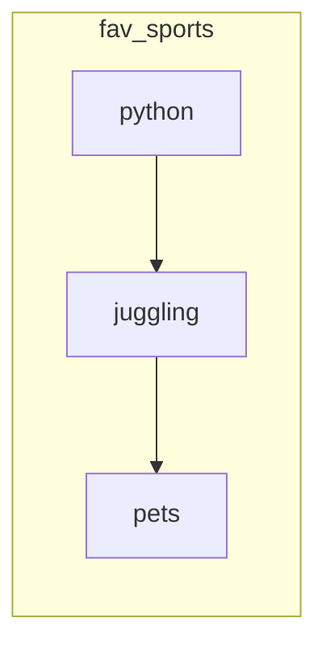
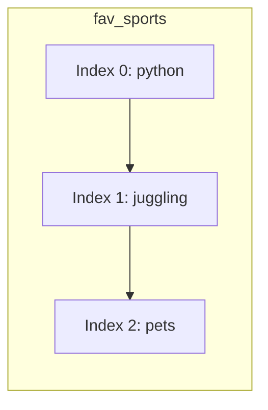
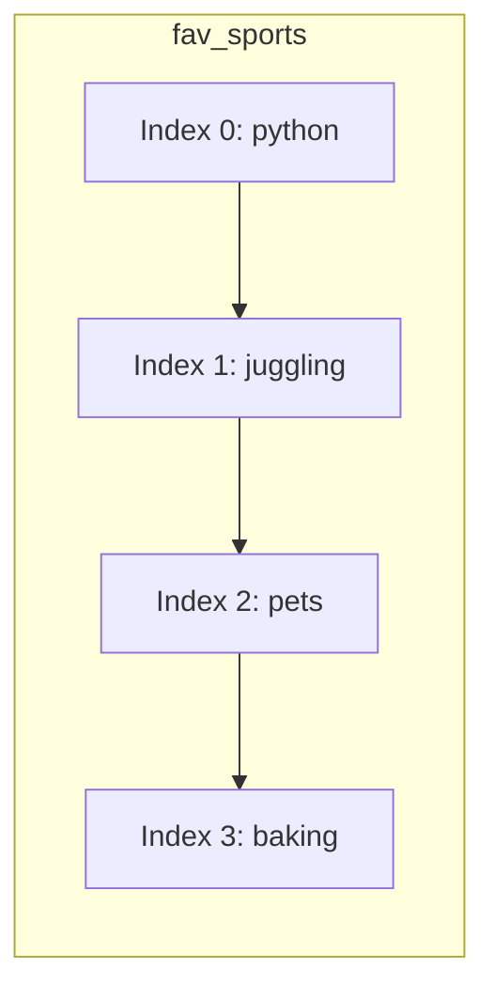
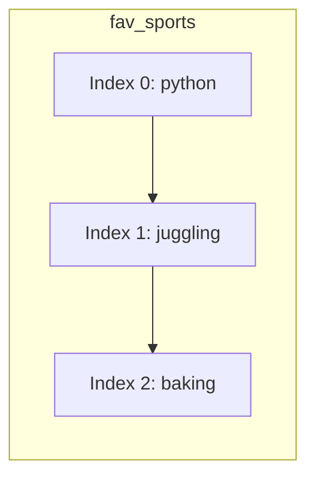
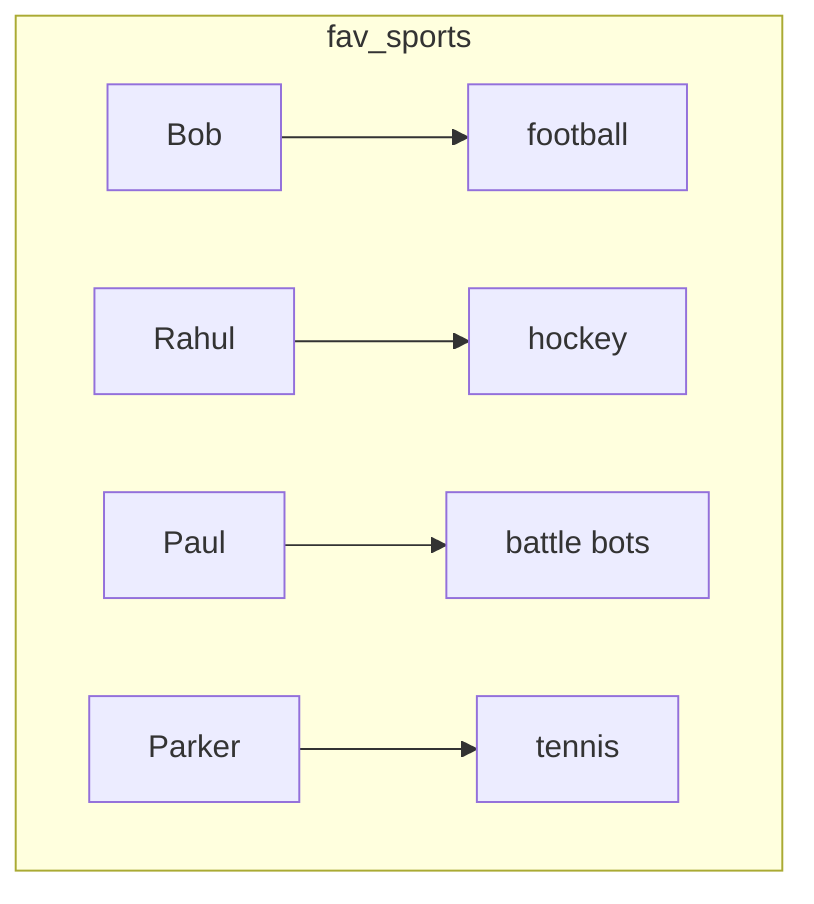
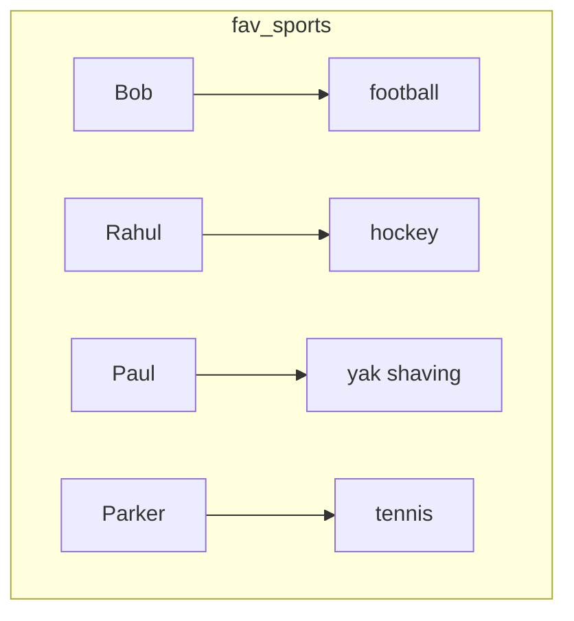
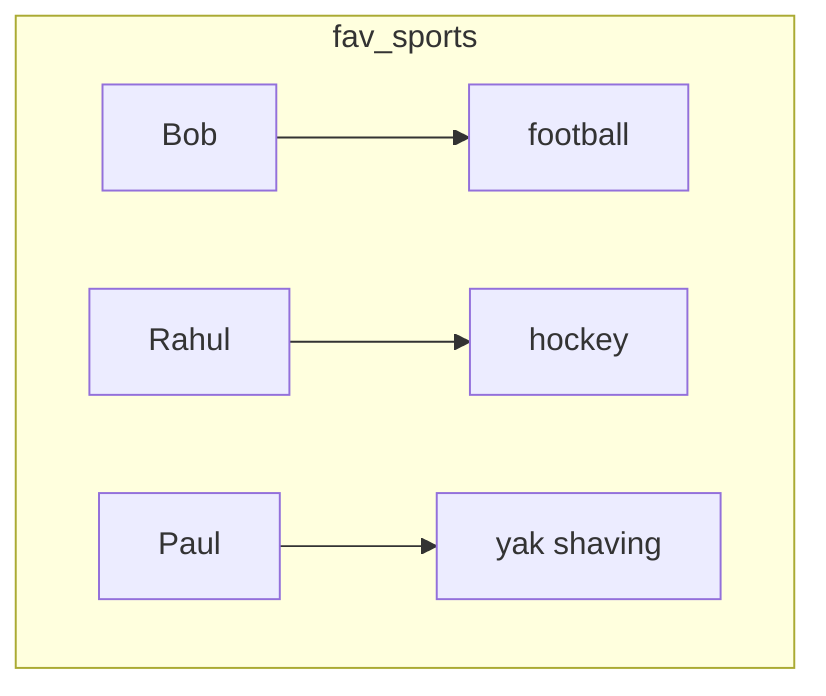

## Strings

Strings are a special concept in python and many other programming languages.  It's a way of sharing words in a computer program.


Let's take a step back and think about the real world.  I have a mini-play.
Let's look at it and try to find which


    Jack and Jill are sitting at a bench.
    Jack turns to Jill.

    "What are you going to be for Halloween" says Jack.

    "I am going to be a computer" replies Jill.


If we look at this play.  How does the actor know which words to speak?


In a computer program, strings are letters strung together as a word.  You use
quotation marks to help distinguish your word from the rest of the program.


```python


my_string = "python is fun"
print(my_string)

my_string = "100 + 200"
print(my_string)


```


Be careful with your strings.  You need to make sure you start it with a quote and end it with a quote, otherwise the program won't know when your string starts and stops

---

## Lists

Let's review variables.  Remember how we used variables in our last lesson?
A list is like a variable.  It has a name and you can store stuff inside of it.

But instead of just storing 1 thing, you can store many things in a list.
If a `variable` is like a single box where 1 thing is stored...
A `list` is like a train, where each car is a new box.


Do this exercise in the tinker box below and not the console since it uses multiple lines.

```python

seminar_list = ['juggling', 'python', 'pets']
print('-------')
print(seminar_list)
```




You can look at what is in the list by giving it an index.


```python
print(seminar_list[0])
print(seminar_list[2])
print(seminar_list[1:3])

```


You can **Add** stuff from your list by using the **append** command
This add it to the end of the list

```python

seminar_list.append('baking')
print(seminar_list)

```





You can **Remove** stuff from your list by using the **del** command

```python

del seminar_list[3]

```





---


## Dictionaries

Has anybody here used a dictionary?  How does it work?  What do we use it for?

``Pause for learners``

``Probe for the meaning of the word``


If I give you a word, like "pie" or "revolution" and you look those words up that word in a dictionary, what does the dictionary
tell you?

Let's take a step back and think about how we use variables in python.  Remember our box and we put values in our box.

If I write a program in python, and I have a variable "coins" and I set the value to 100.
What is the value of "coins"?

This is just one value.  What if I wanted to save multiple values?

So in some sense, a real-world dictionary, is sort of like a book filled with different words and their definitions.

A dictionary in python is like a book filled with labels and values.  Instead of just being limited to definitions, you
can stick anything in a dictionary.

Let's look at a real example.


Do this exercise in the tinker box below and not the console since it uses multiple lines.

```python
fav_sports = {'Bob':'football',
'Rahul': 'hokey',
'Paul': 'battle bots',
'Parker': 'tennis'}

print('-------')

print(fav_sports)
```




**Click the triangle to run your program to see what it does**


```python
print('-------')
print(fav_sports['Paul'])
print('-------')
print('change a value')
fav_sports['Paul'] = 'yak shaving'
print(fav_sports)
print('----')
```




**Click the triangle to run your program to see what it does**

```python
print('delete a value')
del fav_sports['Parker']
print(fav_sports)
```


